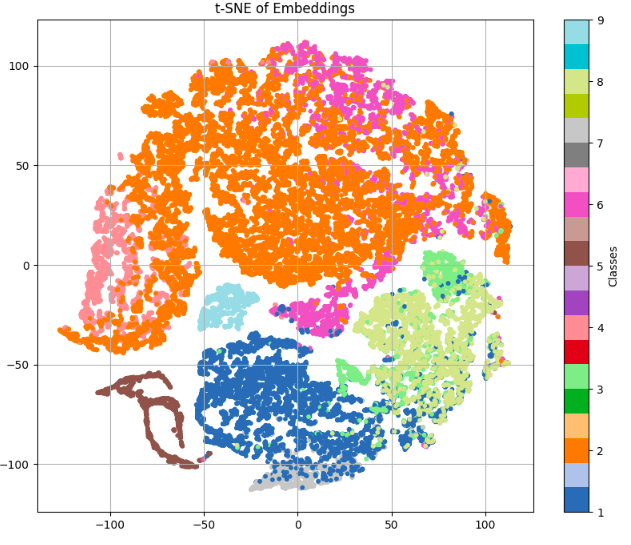

# Deep Contrastive Graph Learning (DCGL) for Hyperspectral Image Classification

**DCGL** is a deep learning framework designed to improve hyperspectral image classification (HSIC) through graph-based representation and contrastive metric learning. It combines spectral similarity-based graph construction, graph convolutional neural networks (GCNs), and two complementary contrastive objectives: **Centroid Metric Loss** and **Triplet Loss** with semi-hard negative mining.

---

## 🔑 Key Components of the Framework

### 1. Spectral Graph Representation

- Each pixel in the hyperspectral image is represented as a node in a graph.
- Edges are weighted by spectral similarity using a Gaussian kernel over Euclidean distances.
- Only significant edges (above a threshold `s`) are retained, yielding a sparse, data-adaptive adjacency matrix.

### 2. GCN-Based Spectral Propagation

- A Graph Convolutional Network (GCN) propagates information.
- Generates latent embeddings that capture local and global spectral dependencies.
- Transforms raw spectral data into a structured feature space.

### 3. Structured Contrastive Embedding Learning

- Two contrastive objectives refine GCN features:
  - **Centroid Metric Loss**: pulls embeddings toward their class centroid.
  - **Triplet Loss with Semi-Hard Negative Mining**: pushes embeddings away from confusing negatives.
- DCGL uses the **class centroid** as the anchor in triplet loss for stability.

### 4. Decoupled Classification Module

- A final classification head is trained using Cross-Entropy Loss on contrastively refined embeddings.
- Contrastive learning is decoupled from supervised classification.
- Improves robustness, generalization, and use of limited labeled data.

---

## 🎯 Highlights of DCGL

- Minimizes intra-class variability and enhances inter-class discrimination.
- Works well in low-label and imbalanced settings.
- Boosts minority class visibility.
- Avoids overfitting through structural constraints.
- Effective even with shallow networks.

---

## 📊 Visualization of Embeddings

**Figure:** t-SNE projection of the high-dimensional embeddings from DCGL on the Pavia University dataset. Each point is a pixel’s learned representation, colored by ground-truth class.

---

### 🔍 Key Observations

- **Well-Separated Clusters**: Most classes form distinct and compact clusters.
- **Intra-Class Compactness**: Tight distributions due to Centroid Metric Loss.
- **Overlap in Complex Classes**: Class 6 and 8 show some overlap, as expected in HSIC.
- **Outlier Suppression**: Few isolated points—indicates robust encoding.
- **Circular Manifold**: Embeddings lie on a smooth circular structure, typical in t-SNE.

> DCGL learns a discriminative and structured representation space that:
> - Separates similar classes,
> - Maintains intra-class cohesion,
> - Supports strong classification performance,
> - Especially effective for spectrally ambiguous or low-frequency categories.

---

## 🌐 Future Perspectives

Future work will:
- Integrate **spatial cues** through spectral-spatial graphs.
- Extend validation to new scenes to assess **scalability and generalization**.

---
